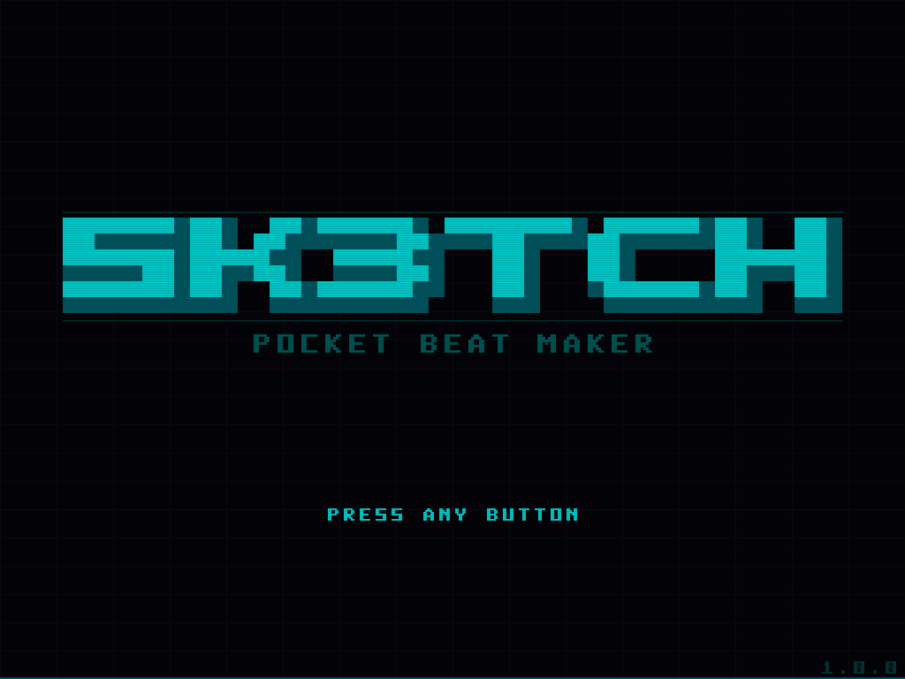
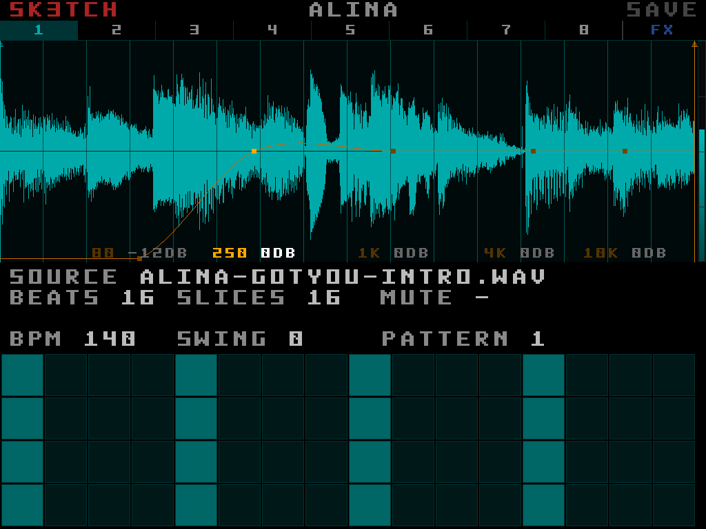
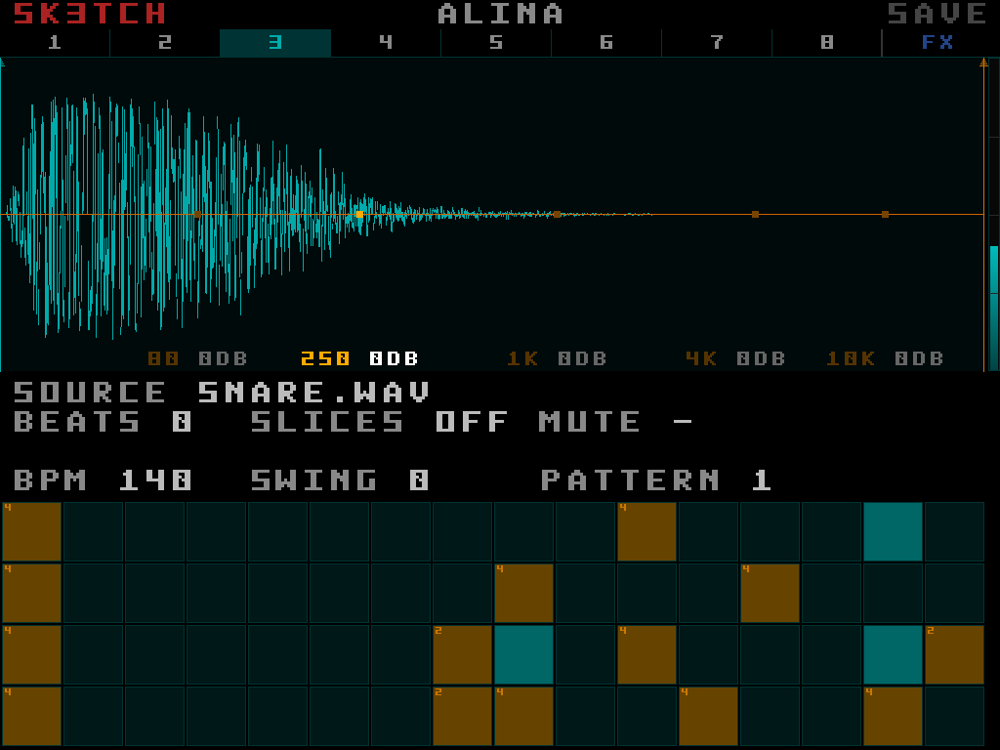
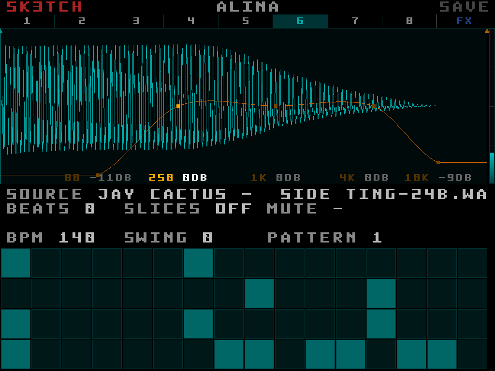
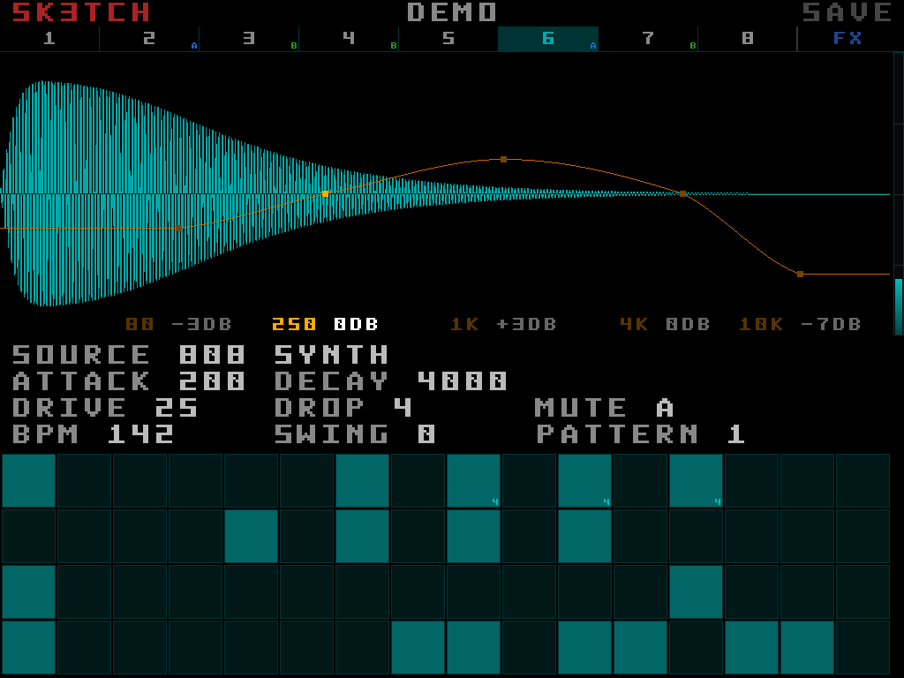
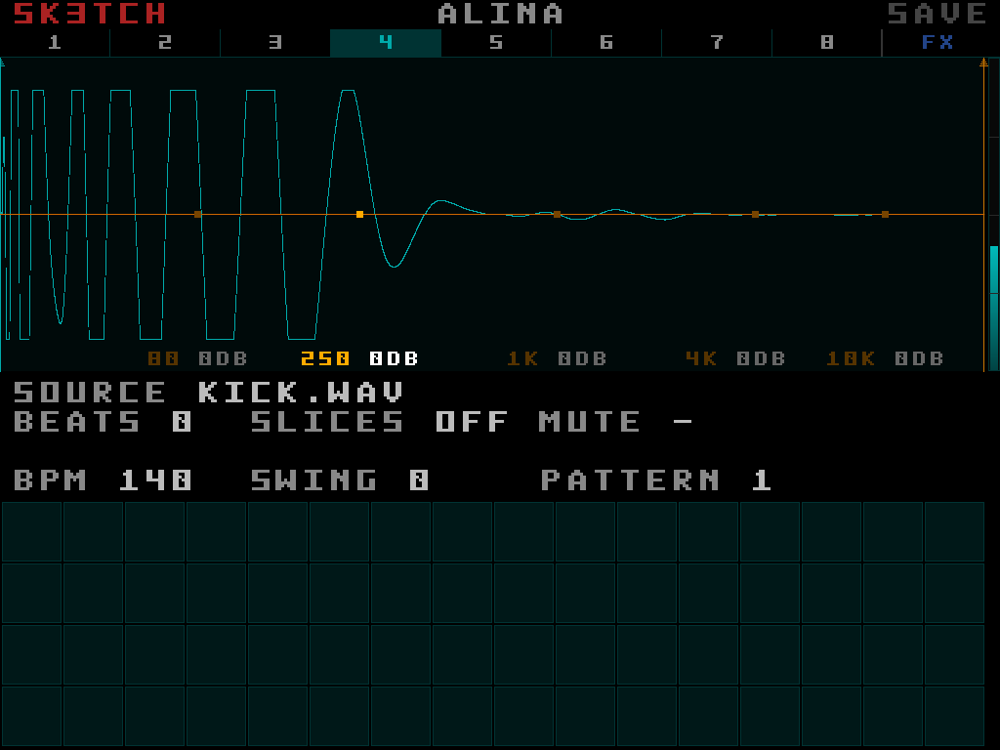

# SK3TCH

**a pocket beat maker for retro gaming handhelds**

SK3TCH is a sample-driven pocket beat maker for the Trimui Brick. It runs on Knulli.
No computer. No DAW. No wifi. Just you, an SD card full of WAVs,
and some time to kill.

Load a sample. Chop it. Stretch it to tempo. Sequence it. Layer
drums. Drop an 808 bass. Dial in the FX. Then jam with punch FX
until something magical falls out.

The whole thing fits in your pocket.

- 8 sample slots with per-slot EQ, level, and time stretch
- 64-step sequencer with 4 patterns and per-step probability, nudge, velocity, offset, ratchet
- 808 synth built in — no bass sample needed
- Insert FX: lofi, vinyl sim, delay, saturation, sidechain
- Live punch FX: tape stop, halftime, double time, reverse, LPF sweep, HPF sweep, stutter, scatter
- FX automation sequencer lane
- Phase vocoder time stretch, background-cached
- Pattern clone for instant variations

---

<p align="center">
  
  
</p>
<p align="center">
  
  
</p>
<p align="center">
  
  
</p>

---

https://github.com/user-attachments/assets/5799c647-3b16-4c04-84c9-9f6264f68c04

---

## install

### Trimui Brick

1. Download `SK3TCH-brick.zip` from [releases](https://github.com/vedsgim/SK3TCH/releases)
2. Extract to `/userdata/roms/ports/` on your Brick
3. Refresh the ports list in Knulli
4. Launch SK3TCH from Ports

The zip contains:
```
ports/
  SK3TCH.sh
  SK3TCH/
    sk3tch          ← binary
    sk3tch.txt      ← manual
    loops/          ← put your samples here
    projects/       ← save files go here
```

---

## supported devices

| device | status |
|---|---|
| Trimui Brick | ✅ |

---

## manual

[sk3tch.txt](sk3tch.txt) — covers everything: trimming · time stretch · slicing · sequencer · drum programming · 808 bass · EQ · insert FX · punch FX · FX automation · projects · recording

Also included in the release zip, readable on-device from the Ports folder.

---

<div align="center">
<sub>built for making beats on a bus · knulli · aarch64</sub>
</div>
